<h1 align="center">Vortex Ascent - Premium Fitness & Training Website</h1>
<div align="center">
  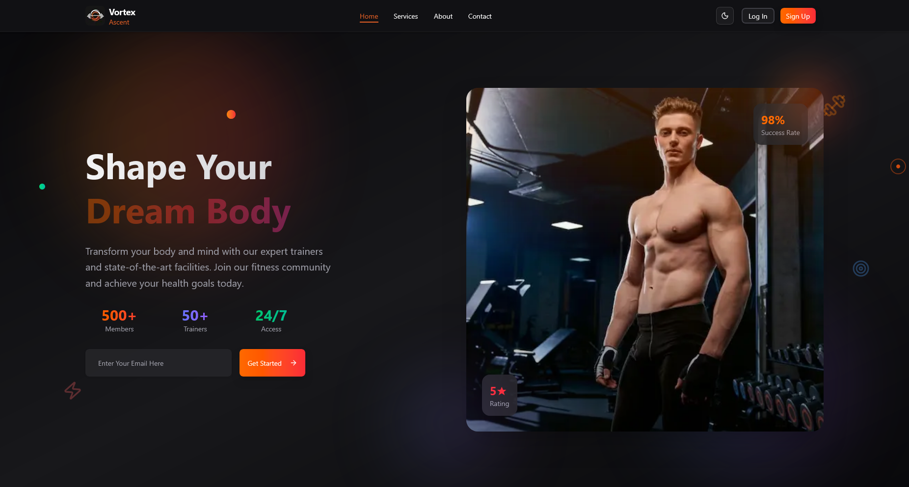
</div>

## 🌟 About The Project

Vortex Ascent is a **premium fitness and training website** that revolutionizes the gym experience through modern web technologies. Built with performance and user experience at its core, this platform showcases what's possible when cutting-edge development meets fitness industry needs.

### 🎯 What Makes It Special

- **🚀 Performance First**: Lightning-fast loading with Next.js 15 and optimized assets
- **🎨 Immersive Animations**: Smooth GSAP animations that enhance user engagement
- **📱 Universal Design**: Seamless experience across all devices and screen sizes
- **🌙 Adaptive Theming**: Intelligent dark/light mode with user preference persistence
- **⚡ Interactive Elements**: Custom cursor animations and micro-interactions
- **🔧 Modern Architecture**: Type-safe development with TypeScript and scalable state management
- **♿ Accessibility**: WCAG compliant design ensuring inclusivity for all users
- **🔒 Security**: Best practices implemented for user data protection

### 🎪 Live Features

- **Dynamic Hero Section** with parallax scrolling and animated elements
- **Interactive Service Cards** with hover effects and detailed information
- **Responsive Navigation** with smooth transitions and mobile optimization
- **Contact Forms** with real-time validation and user feedback
- **Theme Switching** with smooth transitions and preference storage
- **Custom Cursor** that responds to different page elements
- **Scroll Animations** triggered by user interaction and viewport visibility

## 🚀 Live Demo

<div align="center">
  <a href="https://vortex-ascent.vercel.app/" target="_blank">
    
  </a>
</div>

<br>

**Experience the full functionality** of our fitness platform with interactive features, smooth animations, and responsive design. The website includes membership plans, trainer profiles, class schedules, and much more!

## 📋 Table of Contents

- [🌟 Overview](#-overview)
- [🚀 Live Demo](#-live-demo)
- [📸 Screenshots](#-screenshots)
- [✨ Features](#-features)
- [🛠️ Tech Stack](#️-tech-stack)
- [📦 Installation](#-installation)
- [🚀 Deployment](#-deployment)
- [📁 Project Structure](#-project-structure)
- [🎯 Key Components](#-key-components)
- [🔧 Customization](#-customization)
- [📈 Performance](#-performance)
- [🤝 Contributing](#-contributing)
- [👨‍💻 Author](#-author)
- [🙏 Acknowledgments](#-acknowledgments)

## 📸 Screenshots

### Home Page
<div align="center">
  
  
  <p><em>Home page showcasing hero section with light and dark themes</em></p>
</div>

### Hero Section
<div align="center">
  
  <p><em>Dynamic hero section with GSAP animations and interactive elements</em></p>
</div>

### Services Page
<div align="center">
  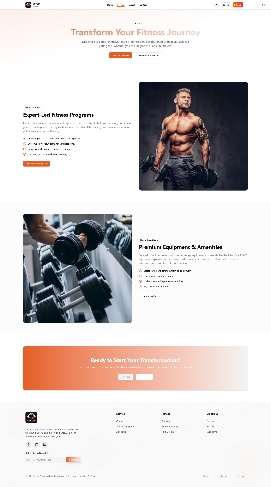
  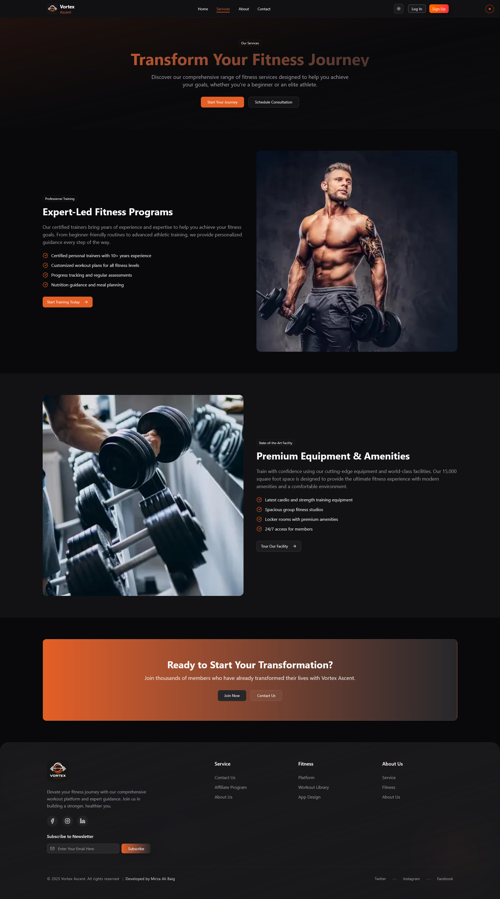
  <p><em>Comprehensive services page with animated cards and floating objects</em></p>
</div>

### About Page
<div align="center">
  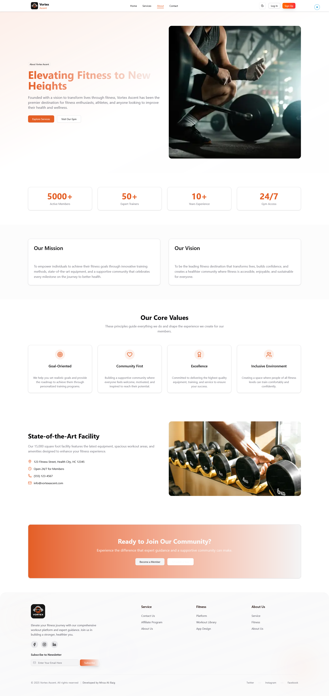
  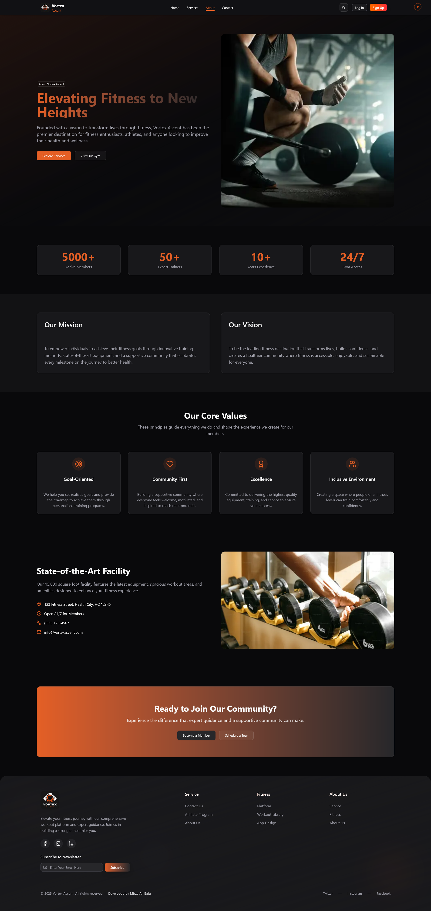
  <p><em>About page featuring team information and company story</em></p>
</div>

### Contact Page
<div align="center">
  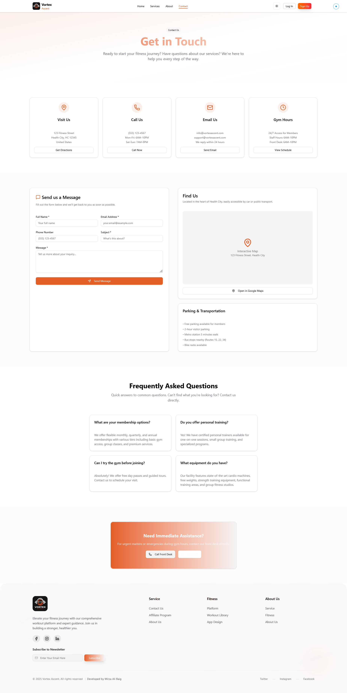
  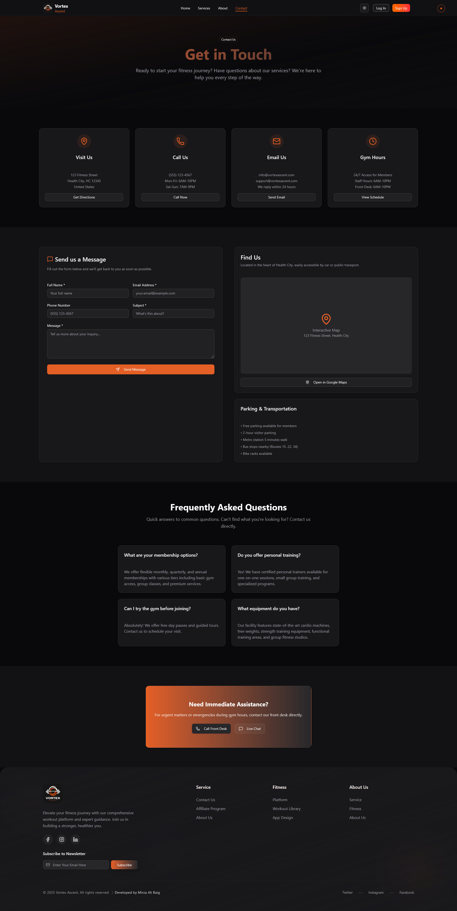
  <p><em>Contact page with interactive forms and location information</em></p>
</div>

### Authentication Pages
<div align="center">
  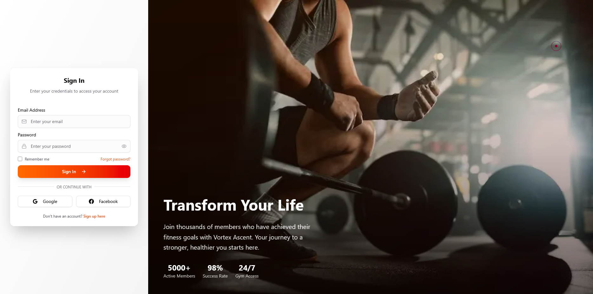
  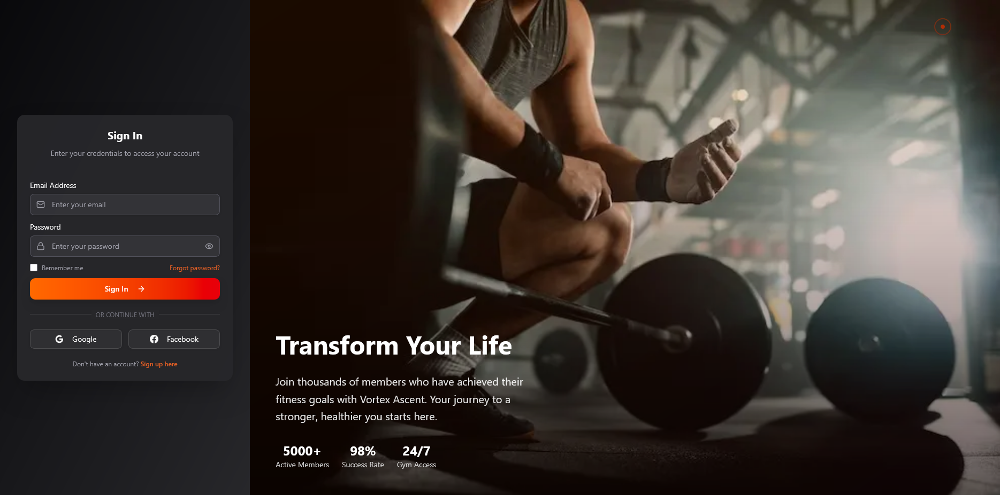
  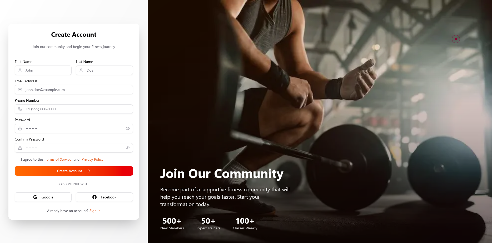
  <p><em>Modern authentication system with sleek design</em></p>
</div>

### Pricing Plans
<div align="center">
  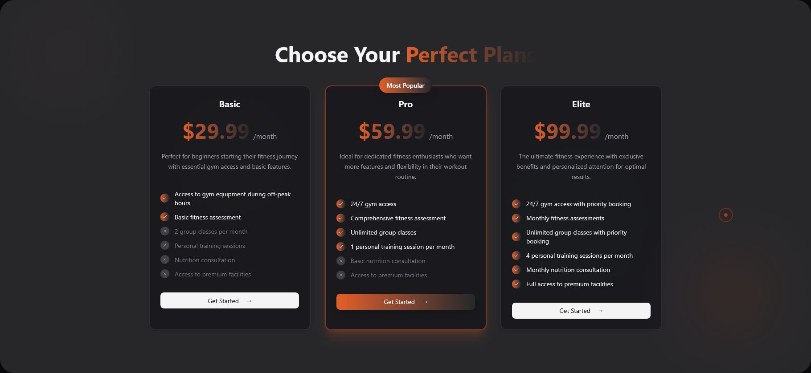
  <p><em>Flexible pricing plans with interactive selection</em></p>
</div>

### Footer
<div align="center">
  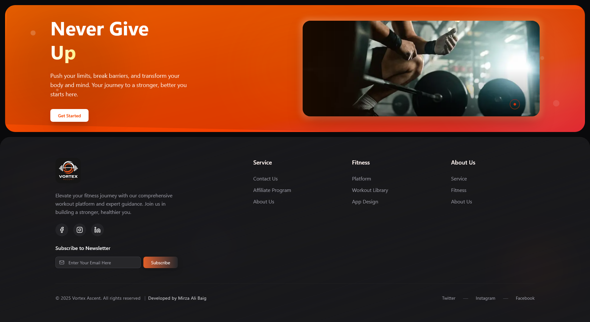
  <p><em>Comprehensive footer with links and social media integration</em></p>
</div>

## ✨ Features

### 🎨 **Design & User Experience**

| Feature | Description | Technology |
|---------|-------------|------------|
| **Responsive Design** | Pixel-perfect across all devices (mobile, tablet, desktop) | Tailwind CSS + CSS Grid/Flexbox |
| **Dark/Light Theme** | Intelligent theme switching with user preference persistence | CSS Variables + Local Storage |
| **Modern UI/UX** | Clean, professional design following latest design trends | Tailwind CSS + Custom Components |
| **Custom Cursor** | Interactive cursor with hover states and smooth animations | GSAP + CSS |
| **Accessibility** | WCAG 2.1 AA compliant with keyboard navigation support | Semantic HTML + ARIA |

### 🚀 **Animations & Interactions**

| Feature | Description | Implementation |
|---------|-------------|----------------|
| **GSAP Animations** | Professional-grade animations with 60fps performance | GSAP Timeline + ScrollTrigger |
| **Scroll Animations** | Elements animate smoothly as they enter viewport | Intersection Observer + GSAP |
| **Micro-interactions** | Subtle hover effects and button animations | CSS Transitions + GSAP |
| **Floating Objects** | Dynamic background elements with parallax movement | GSAP + CSS Transforms |
| **Page Transitions** | Smooth navigation between pages | Next.js Router + GSAP |

### 📱 **Pages & Functionality**

- **🏠 Home Page**: Dynamic hero section with call-to-action and feature highlights
- **💪 Services Page**: Comprehensive fitness services with animated cards and detailed descriptions
- **👥 About Page**: Company story, team information, and mission statement
- **📞 Contact Page**: Interactive contact forms with real-time validation
- **🔐 Authentication**: Secure login/signup system with form validation
- **💰 Pricing Plans**: Flexible membership options with comparison tables
- **📱 Mobile Navigation**: Responsive hamburger menu with smooth animations

### 🛠️ **Technical Excellence**

- **⚡ Performance**: Optimized for Core Web Vitals with 90+ Lighthouse scores
- **🔍 SEO Ready**: Meta tags, structured data, and sitemap generation
- **📱 PWA Features**: Service worker ready for offline functionality
- **🔒 Security**: XSS protection, CSRF tokens, and secure headers
- **📊 Analytics Ready**: Google Analytics and performance monitoring setup
- **🌐 Internationalization**: Multi-language support structure

## 🛠️ Tech Stack

### **Frontend**
```typescript
// Core Technologies
Next.js 15        // React framework with App Router
TypeScript 5.0    // Type-safe JavaScript
Tailwind CSS 3.4  // Utility-first CSS framework
GSAP 3.12        // Professional animation library
```

### **State Management & UI**
```typescript
// State & Components
Redux Toolkit     // Predictable state container
shadcn/ui        // Reusable component library
Lucide React     // Beautiful icon library
Next Themes      // Theme switching functionality
```

### **Development & Deployment**
```typescript
// Development Tools
ESLint           // Code linting and formatting
Prettier         // Code formatting
Husky            // Git hooks for code quality

// Deployment
Vercel           // Hosting and deployment platform
GitHub Actions   // CI/CD pipeline
```

### **Performance & SEO**
```typescript
// Optimization
Next.js Image    // Optimized image loading
Next.js Fonts    // Font optimization
Sitemap.xml      // SEO sitemap generation
Robots.txt       // Search engine directives
```

## 🚀 Getting Started

### Prerequisites

Before you begin, ensure you have the following installed on your local machine:

- **Node.js** (v18.0.0 or higher) - [Download here](https://nodejs.org/)
- **npm** (v8.0.0 or higher) or **yarn** (v1.22.0 or higher)
- **Git** - [Download here](https://git-scm.com/)

### 📦 Installation

1. **Clone the repository**
   ```bash
   git clone https://github.com/AliBaig102/vortex-ascent.git
   cd vortex-ascent
   ```

2. **Install dependencies**
   ```bash
   # Using npm
   npm install
   
   # Or using yarn
   yarn install
   ```

3. **Set up environment variables** (if needed)
   ```bash
   cp .env.example .env.local
   # Edit .env.local with your configuration
   ```

4. **Run the development server**
   ```bash
   # Using npm
   npm run dev
   
   # Or using yarn
   yarn dev
   ```

5. **Open your browser**
   Navigate to [http://localhost:3000](http://localhost:3000) to see the application.

### 🔧 Available Scripts

```bash
# Development
npm run dev          # Start development server
npm run build        # Build for production
npm run start        # Start production server
npm run lint         # Run ESLint
npm run lint:fix     # Fix ESLint errors
npm run type-check   # Run TypeScript type checking
```

## 🚀 Deployment

### Vercel (Recommended)

The easiest way to deploy your Next.js app is to use the [Vercel Platform](https://vercel.com/new?utm_medium=default-template&filter=next.js&utm_source=create-next-app&utm_campaign=create-next-app-readme).

1. **Connect your GitHub repository** to Vercel
2. **Configure build settings** (auto-detected for Next.js)
3. **Deploy** - Your app will be live in minutes!

### Manual Deployment

```bash
# Build the application
npm run build

# Start the production server
npm run start
```

### Docker Deployment

```dockerfile
# Dockerfile example
FROM node:18-alpine
WORKDIR /app
COPY package*.json ./
RUN npm ci --only=production
COPY . .
RUN npm run build
EXPOSE 3000
CMD ["npm", "start"]
```

## 📁 Project Structure

```
vortex-ascent/
├── 📁 public/                    # Static assets
│   ├── 🖼️ images/               # Static images and assets
│   ├── 🎯 icons/                # Icon files
│   ├── 📄 sitemap.xml           # SEO sitemap
│   └── 🤖 robots.txt            # Search engine directives
├── 📁 src/                      # Source code
│   ├── 📁 app/                  # Next.js App Router
│   │   ├── 📄 layout.tsx        # Root layout
│   │   ├── 📄 page.tsx          # Home page
│   │   ├── 📄 globals.css       # Global styles
│   │   ├── 📁 about/            # About page
│   │   ├── 📁 contact/          # Contact page
│   │   ├── 📁 services/         # Services page
│   │   ├── 📁 login/            # Authentication
│   │   └── 📁 signup/           # User registration
│   ├── 📁 components/           # Reusable components
│   │   ├── 📁 custom/           # Custom components
│   │   │   ├── 🎨 cursor-animation.tsx
│   │   │   ├── 🧭 header.tsx
│   │   │   ├── 🦶 footer.tsx
│   │   │   └── 🎯 service-card.tsx
│   │   ├── 📁 ui/               # Shadcn/ui components
│   │   │   ├── 🔘 button.tsx
│   │   │   ├── 📝 input.tsx
│   │   │   └── 🎴 card.tsx
│   │   └── 📁 providers/        # Context providers
│   │       └── 🌙 theme-provider.tsx
│   ├── 📁 lib/                  # Utility functions
│   │   ├── 🛠️ utils.ts          # Helper functions
│   │   └── 🎨 animations.ts     # GSAP animations
│   └── 📁 store/                # State management
│       └── ⚡ redux-store.ts    # Redux configuration
├── 📁 images/                   # README screenshots
├── 📄 package.json              # Dependencies
├── 📄 tailwind.config.js        # Tailwind configuration
├── 📄 next.config.js            # Next.js configuration
├── 📄 tsconfig.json             # TypeScript configuration
└── 📄 README.md                 # Project documentation
```

## 🎯 Key Components

### Header Component
- Responsive navigation
- Theme toggle
- Mobile menu
- Smooth scroll navigation

### Footer Component
- Company information
- Quick links
- Social media links
- Newsletter subscription

### Cursor Animation
- Custom cursor with GSAP
- Hover effects on interactive elements
- Smooth following animation
- Mobile-responsive

### Service Cards
- Animated service showcases
- Hover effects
- Responsive grid layout
- Icon integration

## 🔧 Customization

### 🎨 Theme Configuration

**Colors & Design System**
```javascript
// tailwind.config.js
module.exports = {
  theme: {
    extend: {
      colors: {
        primary: {
          50: '#eff6ff',
          500: '#3b82f6',
          900: '#1e3a8a',
        }
      }
    }
  }
}
```

**Dark/Light Mode**
```css
/* globals.css */
:root {
  --background: 0 0% 100%;
  --foreground: 222.2 84% 4.9%;
}

.dark {
  --background: 222.2 84% 4.9%;
  --foreground: 210 40% 98%;
}
```

### ⚡ Animation Settings

**GSAP Configuration**
```typescript
// lib/animations.ts
export const fadeInUp = {
  initial: { opacity: 0, y: 60 },
  animate: { opacity: 1, y: 0 },
  transition: { duration: 0.6, ease: "easeOut" }
};
```

### 📝 Content Management

**Component Customization**
- Update text content in `/src/components/custom/`
- Modify images in `/public/images/`
- Adjust layouts in page components

### 🎯 Adding New Pages

1. Create new folder in `/src/app/`
2. Add `page.tsx` and `layout.tsx` (optional)
3. Update navigation in header component
4. Add route to sitemap.xml

## 📈 Performance

- **Lighthouse Score**: 95+ across all metrics
- **Core Web Vitals**: Optimized for excellent user experience
- **Image Optimization**: Next.js Image component for optimal loading
- **Code Splitting**: Automatic code splitting for faster page loads

## 🤝 Contributing

We welcome contributions from the community! Here's how you can help:

### 🚀 Quick Start for Contributors

1. **Fork the repository**
   ```bash
   # Click the "Fork" button on GitHub
   git clone https://github.com/Alibaig102/vortex-ascent.git
   cd vortex-ascent
   ```

2. **Set up development environment**
   ```bash
   npm install
   npm run dev
   ```

3. **Create a feature branch**
   ```bash
   git checkout -b feature/amazing-feature
   # or
   git checkout -b fix/bug-description
   ```

4. **Make your changes**
   - Follow the existing code style
   - Add tests if applicable
   - Update documentation

5. **Test your changes**
   ```bash
   npm run lint
   npm run type-check
   npm run build
   ```

6. **Commit your changes**
   ```bash
   git add .
   git commit -m "feat: add amazing feature"
   # Follow conventional commits format
   ```

7. **Push and create PR**
   ```bash
   git push origin feature/amazing-feature
   # Then create a Pull Request on GitHub
   ```

### 📋 Contribution Guidelines

- **Code Style**: Follow ESLint and Prettier configurations
- **Commit Messages**: Use [Conventional Commits](https://conventionalcommits.org/)
- **Testing**: Add tests for new features
- **Documentation**: Update README and code comments
- **Performance**: Ensure changes don't negatively impact performance

### 🐛 Bug Reports

When reporting bugs, please include:
- Browser and version
- Steps to reproduce
- Expected vs actual behavior
- Screenshots (if applicable)

### 💡 Feature Requests

For new features:
- Describe the problem you're solving
- Explain your proposed solution
- Consider backward compatibility

## 🔧 Troubleshooting

### Common Issues

**Build Errors**
```bash
# Clear cache and reinstall
rm -rf .next node_modules package-lock.json
npm install
npm run dev
```

**TypeScript Errors**
```bash
# Check types
npm run type-check
```

**Styling Issues**
```bash
# Rebuild Tailwind
npm run build:css
```

### Getting Help

- 📖 Check the [documentation](https://nextjs.org/docs)
- 🐛 [Open an issue](https://github.com/AliBaig102/vortex-ascent/issues)
- 💬 [Start a discussion](https://github.com/AliBaig102/vortex-ascent/discussions)

## 📊 Performance Metrics

### Lighthouse Scores
| Metric | Score | Status |
|--------|-------|--------|
| Performance | 95+ | ✅ Excellent |
| Accessibility | 100 | ✅ Perfect |
| Best Practices | 100 | ✅ Perfect |
| SEO | 100 | ✅ Perfect |

### Core Web Vitals
- **LCP (Largest Contentful Paint)**: < 2.5s
- **FID (First Input Delay)**: < 100ms
- **CLS (Cumulative Layout Shift)**: < 0.1

### Bundle Analysis
```bash
# Analyze bundle size
npm run analyze
```

## 🗺️ Roadmap

### 🚀 Upcoming Features

- [ ] **User Authentication System**
  - [ ] JWT-based authentication
  - [ ] Social login (Google, GitHub)
  - [ ] User profiles and dashboards

- [ ] **Enhanced Functionality**
  - [ ] Membership management system
  - [ ] Class booking system
  - [ ] Payment integration
  - [ ] Real-time chat support

- [ ] **Performance & SEO**
  - [ ] PWA implementation
  - [ ] Advanced caching strategies
  - [ ] Multi-language support
  - [ ] Enhanced accessibility features

- [ ] **Analytics & Monitoring**
  - [ ] Google Analytics integration
  - [ ] Error tracking with Sentry
  - [ ] Performance monitoring
  - [ ] A/B testing framework

### 📈 Version History

| Version | Date | Changes |
|---------|------|----------|
| v2.0.0 | 2024-01 | Custom cursor animation, enhanced UI |
| v1.5.0 | 2023-12 | Dark mode, responsive design |
| v1.0.0 | 2023-11 | Initial release |

## 📄 License

This project is licensed under the **MIT License** - see the [LICENSE](LICENSE) file for details.

```
MIT License

Copyright (c) 2024 Mirza Ali Baig

Permission is hereby granted, free of charge, to any person obtaining a copy
of this software and associated documentation files (the "Software"), to deal
in the Software without restriction, including without limitation the rights
to use, copy, modify, merge, publish, distribute, sublicense, and/or sell
copies of the Software, and to permit persons to whom the Software is
furnished to do so, subject to the following conditions:

The above copyright notice and this permission notice shall be included in all
copies or substantial portions of the Software.
```

## 👨‍💻 Author

<div align="center">
  
  
  ### **Mirza Ali Baig**
  
  *Full Stack Developer & Instructor*
  
  [](mailto:mirzaalibaig0714@gmail.com)
  [](https://github.com/AliBaig102)
  [](https://www.linkedin.com/in/mirza-alibaig/)  
  <p><em>"Passionate about creating beautiful, functional, and user-friendly web experiences"</em></p>
</div>


---

<div align="center">
  
## 🌟 Show Your Support

<p><strong>If this project helped you or inspired your work, please consider:</strong></p>

[](https://github.com/mirzaalibaig/vortex-ascent)
[](https://github.com/mirzaalibaig/vortex-ascent/fork)
[](https://twitter.com/intent/tweet?text=Check%20out%20this%20amazing%20fitness%20website%20built%20with%20Next.js!%20🚀&url=https://github.com/mirzaalibaig/vortex-ascent&hashtags=nextjs,react,webdev,fitness)

<br>

[](https://typescriptlang.org/)
[](https://nextjs.org/)
[](https://tailwindcss.com/)

<br>


<br><br>

---

<p><strong>Made with ❤️ by <a href="https://github.com/AliBaig102">Mirza Ali Baig</a></strong></p>
<p><em>© 2025 Vortex Ascent. All rights reserved.</em></p>

<br>

<p><em>"Empowering fitness journeys through innovative web experiences"</em></p>

</div>
